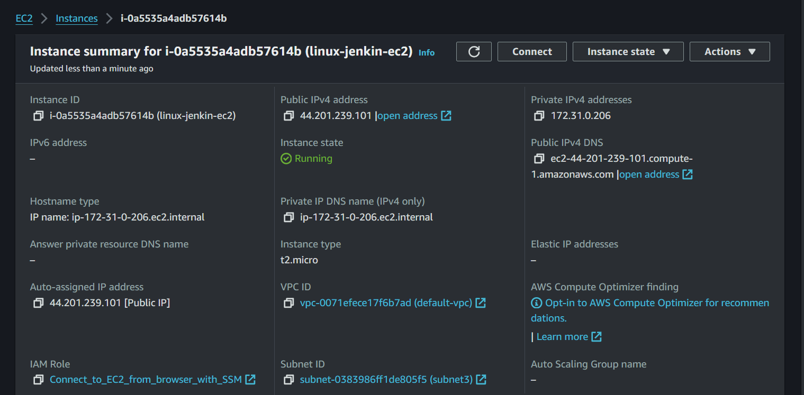
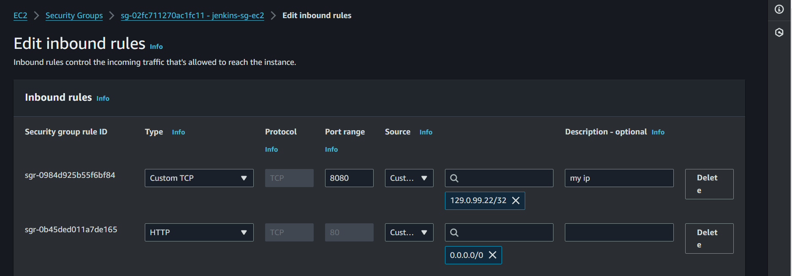
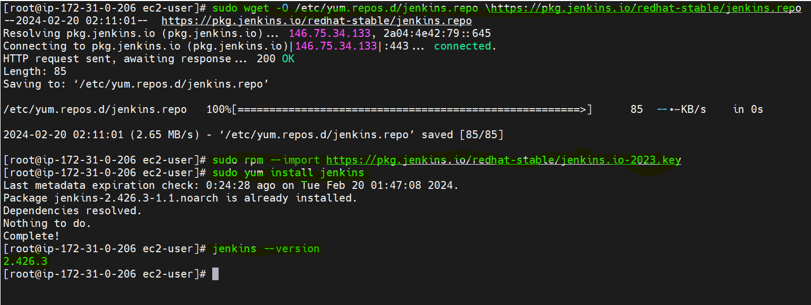

# Simple-CI-CD-pipeline-Integrating-Jenkins-with-Maven-and-GitHub-to-Build-a-job-on-a-Tomcat-server.
This integrated toolchain enhances development speed, ensures code quality, and simplifies the continuous delivery of software applications.

# Objectives:
* Setup Jenkins
* Setup & configure Maven and Git
* Setup Tomcat Server
* Integrating GitHub, Maven, Tomcat Server with Jenkins
* Create a CI and CD job
* Test the deployment

# Prerequisite:
* AWS account(free-tier)
* Java-open-jdk11
* PowerShell
* GitHub account

# ♾️Step 1: Setup Jenkins

1. Name the EC2 instance, choose Amazon Linux 2 AMI, and configure security groups to expose port 8080.

2. Connect to the instance via SSH and Install Jenkins on an Amazon Linux 2 AMI EC2 instance using the [official guide](https://www.jenkins.io/doc/book/installing/linux/) Also follow the steps on my [Github page](https://github.com/Fokoue22/JENKINS-AWS)

## Author
FOKOUE THOMAS 